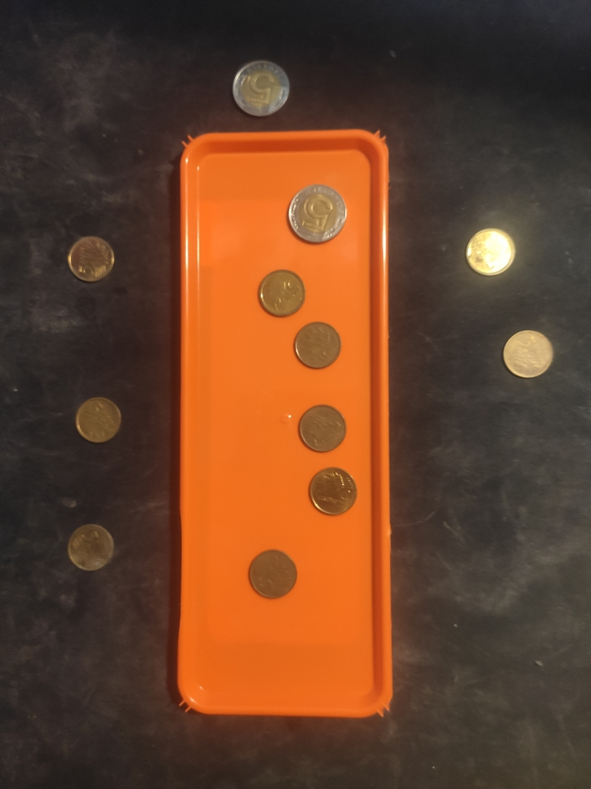
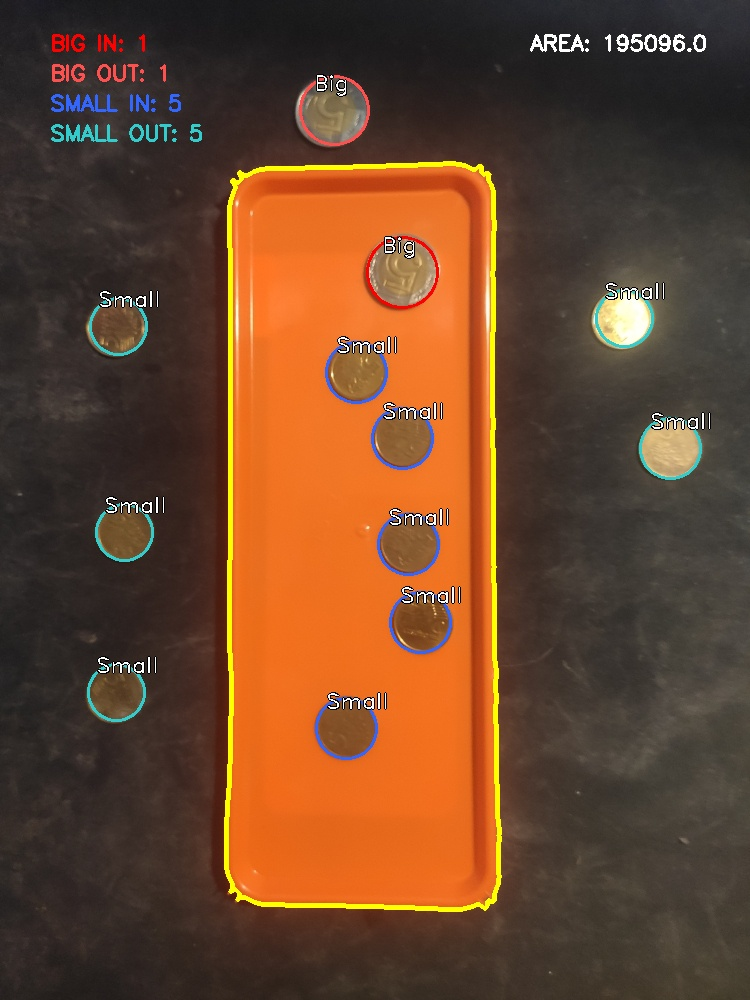

# A Tray and coins
A simple OpenCV project for counting coins inside/outside of a tray.

<div align="center">


</div>

## Task Description
Write a program which finds and calculates coins on tray8.jpg (total 12 points):

1. Find the contour of the tray (2 points).
2. Specify the area of the tray's contour (2 points).
3. Using the Hough transform find as many coins as possible on
drawings (3 points). 
4. Count:
	- the big coins in the tray (1 point),
    - the small coins in the tray (1 point),
	- the big coins out of the tray (1 point),
	- the small coins out of the tray (1 point).
5. Fine-tune system performance to correctly process photos: tray3.jpg and tray7.jpg (1 point).


## Install

Copy the repo:
```shell
git clone https://github.com/HiKami172/tray-coin-detection.git
cd tray-coin-detection
```

Install requirements:
```shell
pip install -r requirements.txt
```

